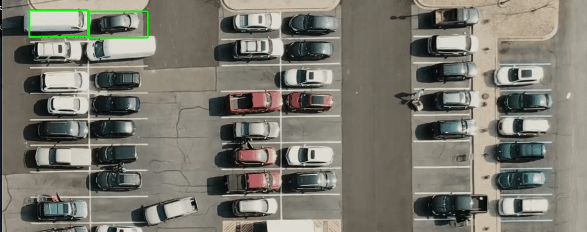

# parking-AI-python

## How to use

1. pip install -r requirements.txt
2. `python parkingSpacePicker`
3. select parking space (left click set, right delete)
4. `python main.py` 
5. watch a effect on my work :D

## Demo parking space picker 

